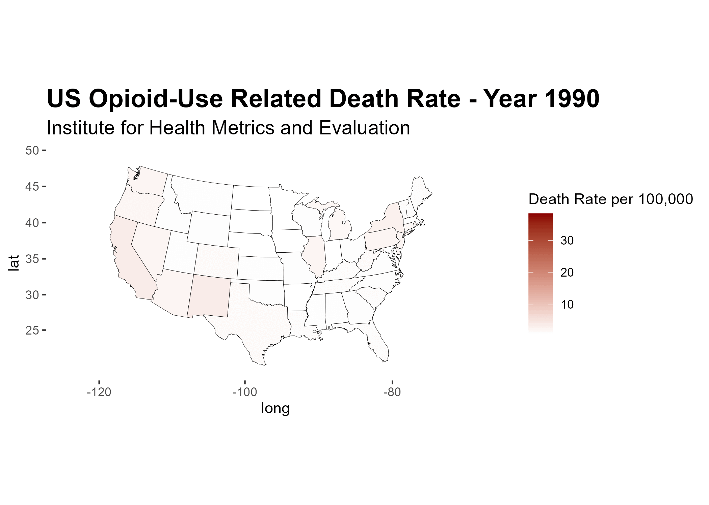

# Background on the Opioid Crisis in America

The United States opioid epidemic is a nationwide public health crisis. Initially driven by increased consumption and availability of pharmaceutical opioids such as oxycontin, an increasing number of opioid overdoses are now related to heroin and illicitly manufactured fentanyl and fentanyl analogs. Deaths related to opioid use have sharply increased from 1996 when advertisement around opioid based pharmaceuticals became unrestricted.

# Research Questions

I wanted to look at the steady increase in opioid-related deaths in the US from 1990 to 2019 with the advent of unrestricted pharmaceutical marketing and deployment . I wanted to plot the data spatially by looking at how opioid related deaths have differed across different US states. However, I wanted to keep the temporal aspect of the data, so therefore I made a data file for every year with every states opioid-related death rate. This allowed the data to be visualized in two separate but congruent ways.

## Data Source

All the data was sourced from the Institute for Health Metrics and Evaluation

## Data Wrangling

First the data needed to be cleaned, this meant deleting unnecessary columns from the data file and merging items together. Each year was separated into its own distinct data file. I also tested one of the individual years and merged it into a map of mainland america to show how the visualisation would be peiced togehter.

```{r, message=FALSE, warning=FALSE}

library(here)
library(tidyverse)
library(readr)
library(ggplot2)
library(shiny)


# read and open data
## save data file as df

df <- read.csv(here('rateofdeath.csv'))


#deleting unnessecary columns

columns_to_delete <- c("measure_id", "measure_name","cause_id", "metric_id","cause_name","metric_name","age_id","sex_id","sex_name","age_name","upper","lower")
df <- df[, !(names(df) %in% columns_to_delete)]


#renaming collumns

##location_name change to state
colnames(df)[colnames(df) == "location_name"] <- "state"

##val change to number_deaths 
colnames(df)[colnames(df)=="val"] <-"death_rate"

# Function to capitalize the first letter of each word in a string
capitalize_state <- function(state_name) {
  str_to_title(state_name)  # Capitalize each word in the string
}

# Capitalize state names in the dataframe
df$state <- sapply(df$state, capitalize_state)


df <- df %>% mutate(number_deaths = as.numeric(death_rate))

#subset data set by year
##1990
desired_year1990 <- 1990
year1990 <- df[which(df$year == desired_year1990),]

##1991
desired_year1991 <- 1991
year1991 <- df[which(df$year == desired_year1991),]

##1992
desired_year1992 <- 1992
year1992 <- df[which(df$year == desired_year1992),]

##1993
desired_year1993 <- 1993
year1993 <- df[which(df$year == desired_year1993),]

##1994
desired_year1994 <- 1994
year1994 <- df[which(df$year == desired_year1994),]

##1995
desired_year1995 <- 1995
year1995 <- df[which(df$year == desired_year1995),]

##1996
desired_year1996 <- 1996
year1996 <- df[which(df$year == desired_year1996),]

##1997
desired_year1997 <- 1997
year1997 <- df[which(df$year == desired_year1997),]

##1998
desired_year1998 <- 1998
year1998 <- df[which(df$year == desired_year1998),]

##1999
desired_year1999 <- 1999
year1999 <- df[which(df$year == desired_year1999),]

##2000
desired_year2000 <- 2000
year2000 <- df[which(df$year == desired_year2000),]

##2001
desired_year2001 <- 2001
year2001 <- df[which(df$year == desired_year2001),]

##2002
desired_year2002 <- 2002
year2002 <- df[which(df$year == desired_year2002),]

##2003
desired_year2003 <- 2003
year2003 <- df[which(df$year == desired_year2003),]

##2004
desired_year2004 <- 2004
year2004 <- df[which(df$year == desired_year2004),]

##2005
desired_year2005 <- 2005
year2005 <- df[which(df$year == desired_year2005),]

##2006
desired_year2006 <- 2006
year2006 <- df[which(df$year == desired_year2006),]

##2007
desired_year2007 <- 2007
year2007 <- df[which(df$year == desired_year2007),]

##2008
desired_year2008 <- 2008
year2008 <- df[which(df$year == desired_year2008),]

##2009
desired_year2009 <- 2009
year2009 <- df[which(df$year == desired_year2009),]

##2010
desired_year2010 <- 2010
year2010 <- df[which(df$year == desired_year2010),]

##2011
desired_year2011 <- 2011
year2011 <- df[which(df$year == desired_year2011),]

##2012
desired_year2012 <- 2012
year2012 <- df[which(df$year == desired_year2012),]

##2013
desired_year2013 <- 2013
year2013 <- df[which(df$year == desired_year2013),]

##2014
desired_year2014 <- 2014
year2014 <- df[which(df$year == desired_year2014),]

##2015
desired_year2015 <- 2015
year2015 <- df[which(df$year == desired_year2015),]

##2016
desired_year2016 <- 2016
year2016 <- df[which(df$year == desired_year2016),]

##2017
desired_year2017 <- 2017
year2017 <- df[which(df$year == desired_year2017),]

##2018
desired_year2018 <- 2018
year2018 <- df[which(df$year == desired_year2018),]

##2019
desired_year2019 <- 2019
year2019 <- df[which(df$year == desired_year2019),]

#making and merging map data
library(maps)
us_states <- map_data("state")

#change region to state in map data
colnames(us_states)[colnames(us_states) == "region"] <- "state"

#make states start with capital letters
us_states$state <- sapply(us_states$state, capitalize_state)


#create map for 1990
p1990 <- ggplot(data = us_states,
            mapping = aes(x = long, y = lat,
                          group = group))

p1990 + geom_polygon(fill = "white", color = "black")


p1990 <- ggplot(data = us_states,
            aes(x = long, y = lat,
                group = group, fill = state))

p1990 + geom_polygon(color = "gray90", size = 0.1) + guides(fill = FALSE)

#align map to correct latitude and longitude
p1990 <- ggplot(data = us_states,
            mapping = aes(x = long, y = lat,
                          group = group, fill = state))

p1990 + geom_polygon(color = "gray90", size = 0.1) +
  coord_map(projection = "albers", lat0 = 39, lat1 = 45) +
  guides(fill = FALSE)

#join opioid death data with map data
map1990 <- left_join(year1990, us_states)

#plot opioid death on map data for 1990
p1990 <- ggplot(data = map1990,
            aes(x = long, y = lat,
                group = group, fill = death_rate))

p1990 + geom_polygon(color = "gray90", size = 0.1) +
  coord_map(projection = "albers", lat0 = 39, lat1 = 45) +
  scale_fill_gradient(low = "white", high = "darkred", na.value = "white", name = "Death Rate per 100,000")

```

# Making maps for each year

To make my next plot of a gif I needed to make a plot for each year that didn't change scales according to the specific death rate of that year. The scale was made constant and each figure saved into a separate file called 'figures'.

```{r message=FALSE, warning=FALSE}
#make a loop for all death maps 1990-2019
#keep death rate scale constant through all years to show true change in death rate

##
library(dplyr)
library(ggplot2)

# Assuming 'figures' is the name of your directory for saving plots
figures <- "figures"

# Create the directory if it doesn't exist
if (!file.exists(figures)) {
  dir.create(figures)
}

# Function to generate and save map for a specific year
generate_and_save_map <- function(current_year) {
  # Filter data for the current year
  current_data <- df %>% filter(year == current_year)
  
  # Left join with map data
  map_data <- left_join(current_data, us_states, by = "state")
  
  # Calculate overall scale limits based on death_rate (across all years)
  overall_scale_limits <- range(df$death_rate, na.rm = TRUE)
  
  # Create the plot
  p <- ggplot(data = map_data, aes(x = long, y = lat, group = group, fill = death_rate)) +
    geom_polygon(color = "black", size = 0.1) +
    coord_map(projection = "albers", lat0 = 39, lat1 = 45) +
    scale_fill_gradient(low = "white", high = "darkred", na.value = "yellow", 
                        name = "Death Rate per 100,000", limits = overall_scale_limits) +
    ggtitle(paste("US Opioid-Use Related Death Rate - Year", current_year)) +
    labs(subtitle = "Institute for Health Metrics and Evaluation") +
    theme(plot.title = element_text(size = 18, face = "bold"),
          plot.subtitle = element_text(size = 14),
          panel.grid.major = element_blank(),  # Remove major gridlines
          panel.grid.minor = element_blank(),
          panel.background = element_rect(fill = "transparent"))
  
  # Define the filepath for saving the image in the "figures" directory
  filepath <- file.path(figures, paste("opioid_death_map_", current_year, ".png", sep = ""))
  
  # Save the plot as an image in the "figures" directory
  ggsave(filename = filepath, plot = p)
}

# Generate and save maps for each year from 1990 to 2019
lapply(1990:2019, generate_and_save_map)
```

# Making a gif

Using the images created previously, I used the magick package to knit them together into a gif, this was then saved as an output and loaded onto the rmarkdown document

```{r message=FALSE, warning=FALSE}

# Install and load the magick package
library(magick)


figures_directory <- "figures"

# Get the list of PNG files in the "figures" directory
file_names <- list.files(path = figures_directory, pattern = "\\.png$", full.names = TRUE)

# Read the PNG files into R as magick images
images <- image_read(file_names)

# Create the animation with a frame rate of 24 frames per second
animation <- image_animate(images, fps = 2)

# Specify the output format as GIF when writing the animation
animation_file <- "output.gif"
image_write(animation, animation_file, format = "gif")
```



# Making an Interactive Map

Finally I wanted the visualisation to have the interactive element of changing the year automatically. However, this just functioned as a slowed down adjustable gif

```{r message=FALSE, warning=FALSE}
#making maps that change by year and you can look at inidividual death rate for each state

library(shiny)
library(sass)
library(shinyWidgets)


overall_scale_limits <- range(df$death_rate, na.rm = TRUE)

map_changing <- fluidPage(
  titlePanel("US Opioid-Use Related Death Rate"),
  
  # Create a slider input for selecting the year
  sliderTextInput("year", "Select Year:",
                  choices = as.character(1990:2019), selected = "1990"),
  
  # Display the plot
  plotOutput("map")
)

server <- function(input, output) {
  # Generate the plot based on the selected year
  output$map <- renderPlot({
    current_data <- df %>% filter(year == input$year)
    map_data <- left_join(current_data, us_states, by = "state")
    
    ggplot(data = map_data,
           aes(x = long, y = lat,
               group = group, fill = death_rate)) +
      geom_polygon(color = "black", size = 0.1) +
      coord_map(projection = "albers", lat0 = 39, lat1 = 45) +
      scale_fill_gradient(low = "white", high = "darkred", na.value = "yellow", 
                          name = "Death Rate", limits = overall_scale_limits) +
      ggtitle(paste("US Opioid-Use Related Death Rate - Year", input$year)) +
      labs(subtitle = "Institute for Health Metrics and Evaluation") +
      theme(plot.title = element_text(size = 18, face = "bold"),
            plot.subtitle = element_text(size = 14),
            panel.grid.major = element_blank(),  
            panel.grid.minor = element_blank(),
            panel.background = element_rect(fill = "transparent"))
  })
}

shinyApp(map_changing, server)

```

# Final Visualisation

To rectify the previous issues with the plot, I combined the shiny and plotly packages to make an interactive map where there is a hover function to look at the specific death rate and state whilst having the ability to adjust the year.

```{r message=FALSE, warning=FALSE}

#Combine shiny and plotly to make an interactive map where you can hover over the states to see a value and also go through year by year

##
library(shiny)
library(ggplot2)
library(plotly)
library(dplyr)


ui <- fluidPage(
  titlePanel("US Opioid-Use Related Death Rate"),
  
  # Create a slider input for selecting the year
  sliderTextInput("year", "Select Year:",
                  choices = as.character(1990:2019), selected = "1990"),
  
  # Display the plot
  plotlyOutput("map"),
   tags$footer(
    style = "text-align: right; font-style: italic; color: #666; padding-right: 20px;",
    "Data Source: Institute for Health Metrics and Evaluation"
  )
)

server <- function(input, output) {
  # Generate the plot based on the selected year
  output$map <- renderPlotly({
    current_data <- df %>% filter(year == input$year)
    map_data <- left_join(current_data, us_states, by = "state")
    
    p <- ggplot(data = map_data,
                aes(x = long, y = lat,
                    group = group, fill = death_rate,
                    text = paste("<b>State:</b> ", state,
                                 "<br><b>Death Rate:</b> ",
                                 sprintf("%.2f", death_rate)))) +
      geom_polygon(color = "black", size = 0.1) +
      coord_map() +
      scale_fill_gradient(low = "white", high = "darkred",
                          na.value = "yellow", name = "Death Rate",
                          limits = range(df$death_rate, na.rm = TRUE)) +
      ggtitle(paste("US Opioid-Use Related Death Rate - Year", input$year),
              subtitle = "Institute for Health Metrics and Evaluation") + 
              labs(x = "Longitude", y = "Latitude") +
      theme(
        plot.title = element_text(size = 18, face = "bold"),
        plot.subtitle = element_text(size = 14),
        panel.grid.major = element_blank(),
        panel.grid.minor = element_blank(),
        panel.background = element_rect(fill = "transparent"))
    
    ggplotly(p, tooltip = "text") %>% 
      layout(
        geo = list(
          projection = list(type = 'albers usa'),
          showland = TRUE, landcolor = 'gray')) 
  })
}

shinyApp(ui = ui, server = server)
```
